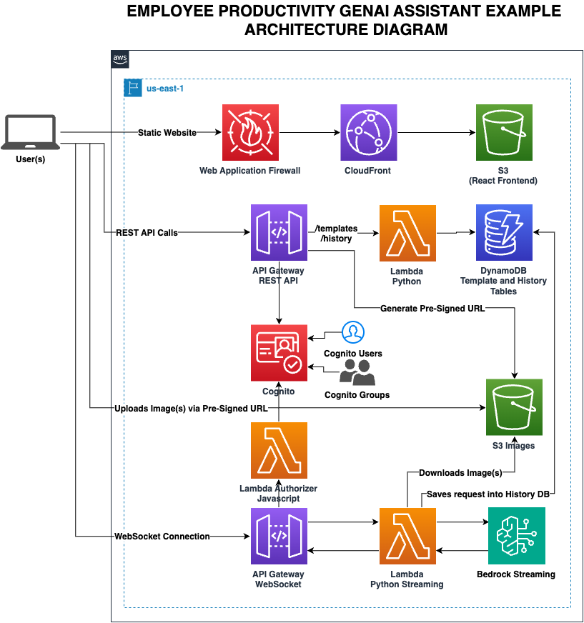
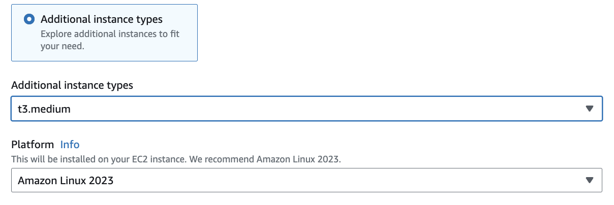
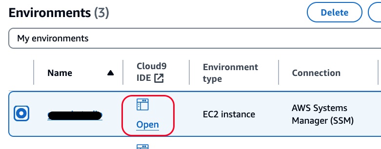
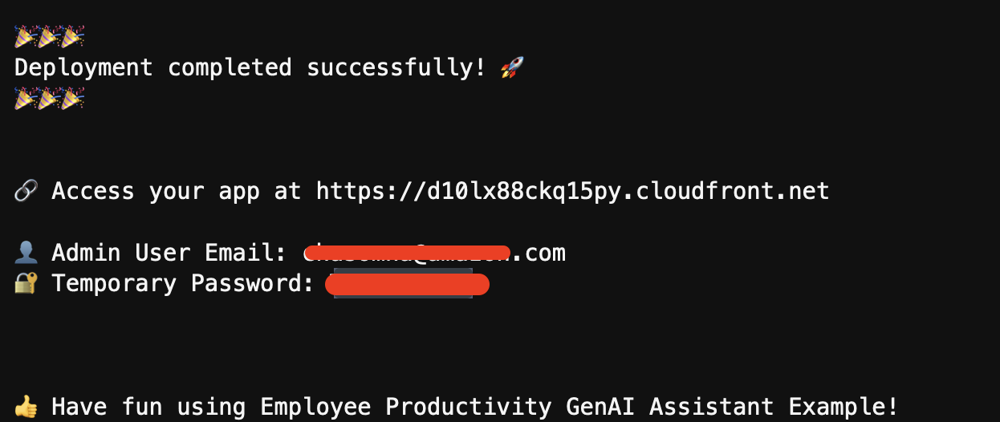
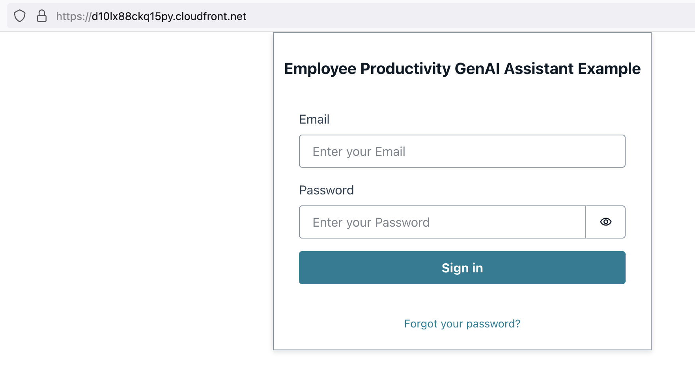

# Employee Productivity GenAI Assistant Example 🌌

## Table of Contents
1. [Summary](#summary-) 
2. [Architecture Diagram](#architecture-diagram-%EF%B8%8F)
3. [Folder Structure](#folder-structure-)
4. [Pre-requisites](#pre-requisites-%EF%B8%8F)
5. [How to Deploy Locally](#how-to-deploy-locally-)
6. [How to Deploy via AWS CloudShell](#how-to-deploy-via-aws-cloudshell-%EF%B8%8F)
7. [How to Deploy via AWS Cloud9](#how-to-deploy-via-aws-cloud9-%EF%B8%8F)
8. [Post Deployment Steps](#post-deployment-steps-%EF%B8%8F)
9. [Tool Demo (GIFs)](#employee-productivity-genai-assistant-example-demo-gifs-)
10. [Cost Estimation](#cost-estimation-)
11. [Acknowledgements](#acknowledgements-)
12. [License](#license-)
13. [Contributing](#contributing-)
14. [Key Considerations](#key-considerations-)

## Summary 📝

**Employee Productivity GenAI Assistant Example** is an innovative code sample designed to elevate the efficiency and effectiveness of writing tasks through the integration of AI technologies. Tailored for AWS users, this assistant example utilizes Amazon Bedrock and generative AI models to automate the creation of initial templates, that can also be customized for your own needs. Users can input both text and images, benefiting from the multimodal capabilities of cutting-edge AI like the Claude 3 family, which supports dynamic interaction with multiple data types.

The Employee Productivity GenAI Assistant Example is built on robust AWS serverless technologies such as Lambda, API Gateway, DynamoDB, and S3, ensuring scalability, high availability, and security through Cognito. These technologies provide a foundation that allows the Employee Productivity GenAI Assistant Example to respond on-demand to user needs while maintaining strict security standards. The core of its generative abilities is derived from the powerful AI models available in Amazon Bedrock, which help deliver tailored and high-quality content swiftly.

Employee Productivity GenAI Assistant Example showcases its functionalities through a series of interactive [GIFs](#employee-productivity-genai-assistant-example-demo-gifs-), making it easy for users to understand and utilize its features:

- **Playground Usability:** Users can interact directly with AI models, as shown in the GIF where a poem about New York is generated, demonstrating real-time data streaming.
- **Template Creation:** This feature allows users to engineer and reuse prompts, such as creating a template for generating product names based on descriptions and keywords.
- **Template Application in Activity:** Demonstrates the practical application of templates, like naming a noise-canceling headphone, where the template automatically includes all necessary information.
- **Activity History Feature:** This logs all interactions within the Playground and Activity areas, ensuring that every detail from past activities is accessible for review and tracking.
- **Interactive Chat with Templates:** Enhances the utility of templates through a chat interface, allowing users to refine outputs using natural language interactions.
- **Multi-Modality Input:** Supports the upload and use of up to six images, providing inputs for AI models to generate rich, context-aware responses.
- **Markdown Output Formatting:** Enhances readability and structure of AI-generated content by supporting markdown formatting in the output. This feature allows for better organization of information, including headers, lists, code blocks, and more, directly in the assistant's responses.


By providing a streamlined interface and comprehensive tools, Employee Productivity GenAI Assistant Example not only simplifies the generation of complex documents but also enhances user productivity and creativity. This GitHub repository serves as a guide for deploying this solution on user-owned AWS accounts, ensuring that anyone can set up and start benefiting from the advanced capabilities of this AI-powered writing assistant.

**Architectural Patterns and Reusable Components**

In addition to the interactive features, the Employee Productivity GenAI Assistant Example provides a robust architectural pattern for building Generative AI solutions on AWS. By leveraging Amazon Bedrock and AWS serverless services such as Lambda, API Gateway, and DynamoDB, the example demonstrates a scalable and secure approach to deploying Generative AI applications. This architecture pattern can be used as a foundation to build various Generative AI solutions tailored to different use cases. Furthermore, the solution includes a reusable component-driven UI built on the React framework, enabling developers to easily extend and customize the interface to fit their specific needs. The example also showcases the implementation of streaming support using WebSockets, allowing for real-time responses in both chat-based interactions and one-time requests, enhancing the user experience and responsiveness of the Generative AI assistant.

## Architecture Diagram 🏛️



## Folder Structure 📂
```
improve-employee-productivity-using-genai/
│
├── backend/ - Contains all backend related files.
│ ├── artifacts/ - Artifacts such as screenshots
│ ├── src/ - Source code for Lambda functions.
│ ├── utils/ - Utility scripts such as helper to create Cognito users  
│ ├── layer/ - Code for Lambda layers.
│ └── template.yaml - Main SAM template for Infrastructure as Code (IaC) deployment.
│
└── frontend/ - Houses the frontend React application.
│ ├── src/ - Main folder for React code.
│     └── App.js - Entry point for the React application.
│ └── .env - Environment variables created on deployment (auto-generated).
│
├── deploy.sh - Single bash script for deploying both backend and frontend.
└── default_templates.json - Default templates that gets uploaded to DynamoDB at deployment for bootstrap.


```

## Pre-requisites 🛠️

Before you begin with the deployment and development of Employee Productivity GenAI Assistant Example, ensure you have the following pre-requisites set up:
- **Miniconda**: Requred for isolated envionments on MAC, helpful when using multiple python versions. [Download Here] (https://docs.anaconda.com/free/miniconda/)
- **AWS CLI 2.x**: Installed and authenticated. [Follow these instructions](https://docs.aws.amazon.com/cli/latest/userguide/getting-started-install.html) for installation and setup.
- **AWS SAM CLI**: Required for deploying serverless applications. [Install the SAM CLI here](https://docs.aws.amazon.com/serverless-application-model/latest/developerguide/install-sam-cli.html).
- **Linux Environment with Bash**: 
  - If you are using Windows, you will need to install the Windows Subsystem for Linux (WSL) [Instructions for WSL installation](https://learn.microsoft.com/en-us/windows/wsl/install). 
  - If you don't want to install WSL, please use the [How to Deploy With Docker (Simplified Local Dependencies)](#how-to-deploy-with-docker-simplified-local-dependencies-) section to deploy using Docker for simplified dependencies. 
- **NodeJS**: Version 16 or newer. NodeJS is essential for running the frontend. [Install NodeJS from here](https://nodejs.org/en/learn/getting-started/how-to-install-nodejs).
- **Python3**: Python 3.11 or new. And make sure you have `pip` installed and working 
- **jq**: jq is a lightweight and flexible command-line JSON processor, [Install jq from here](https://jqlang.github.io/jq/download/)
- **Bedrock Model Access for Claude Models**: Please make sure to enable ALL Claude models in the Amazon Bedrock console within the AWS region you plan to deploy Employee Productivity GenAI Assistant Example. Here's the AWS documentation about [Amazon Bedrock Model Access](https://docs.aws.amazon.com/bedrock/latest/userguide/model-access.html)

Please ensure these are installed and properly configured before proceeding with the deployment or development of Employee Productivity GenAI Assistant Example.

## How to Deploy Locally 🚀

> :warning: **Important**: Before proceeding with the deployment, make sure you have completed all the [Pre-requisites](#pre-requisites-%EF%B8%8F). 

Deployment of Employee Productivity GenAI Assistant Example involves executing a bash script that handles the setup of both the backend and frontend. Below are the detailed steps that the script performs:

### Usage

To deploy Employee Productivity GenAI Assistant Example, use the following commands in your terminal, including the AWS region as a required argument:

- To deploy both backend and frontend: `./deploy.sh --region=your-aws-region --email=your-email`
- To deploy only the backend: `./deploy.sh --backend --region=your-aws-region --email=your-email`
- To deploy only the frontend: `./deploy.sh --frontend --region=your-aws-region --email=your-email`
- To delete the stack: `./deploy.sh --delete --region=your-aws-region --email=your-email`
- To deploy the solution with SAM CLI using a Docker container (to handle dependencies that require specific versions or binaries not present in your environment): `./deploy.sh --container --region=your-aws-region --email=your-email`

Replace `your-aws-region` with the appropriate AWS region (e.g., `us-east-1`)

🚨 Ensure to run these commands from the root of the project directory and replace `your-aws-region` with the actual AWS region you intend to use.

Once you have finished deployed, go to instructions below on [Post-Deployment Steps](#post-deployment-steps-).

For some details on what the script does, see below:

1. **Initialization and Parsing Flags**:
   - The script starts by setting an exit on error mode and parsing flags for backend, frontend, and deletion operations.
2. **Stack Deletion (Optional)**:
   - If the `--delete` flag is used, the script prompts for confirmation to delete the specified AWS stack.
3. **Setting Variables**:
   - Default stack name, SAM template path, frontend directory, and AWS region are defined.
4. **Prerequisites Check**:
   - Checks if Node.js (version 16+), AWS SAM CLI, and AWS CLI are installed and configured.
5. **Backend Deployment (if `--backend` is specified)**:
   - Installs dependencies for Lambda layers.
   - Builds the SAM template using:
     - Standard build: `sam build --template "$SAM_TEMPLATE" --parallel --cached` 
     - Docker container build, if `--container` is specified the `./deploy.sh` it'll trigger to run the SAM like: `sam build --template "$SAM_TEMPLATE" --parallel --cached --use-container`
         - This option is beneficial when working with dependencies that require specific versions or system binaries, ensuring compatibility and ease of build without modifying your local environment.
6. **Frontend Deployment (if `--frontend` is specified)**:
   - Fetches outputs from the deployed backend stack (API URL, WebSocket URL, Cognito User Pool IDs, S3 Bucket name, and CloudFront distribution details).
   - Creates or overwrites the `.env` file in the frontend directory with these outputs.
   - Also creates or overwrites `aws-exports.json` for AWS configuration.
   - Builds the React application and syncs it with the specified S3 bucket.
   - Invalidates the CloudFront distribution cache to ensure the latest version of the site is served.
7. **Completion**:
   - The script ends with a success message, URLs for user registration (Cognito), and the application access link (CloudFront).
  
## How to Deploy via AWS CloudShell ☁️

[AWS CloudShell](https://aws.amazon.com/cloudshell/) allows you to have a free, and instant Linux environment acessible from within your AWS console. To install the solution using AWS CloudShell, please follow the steps below in order.

1. **Installing Dependecies**:
   First, ensure you have the necessary development tools and libraries installed. Open AWS CloudShell and execute the following commands:

   ```sh
   # Install Development Tools
   sudo yum groupinstall "Development Tools" -y && \
   
   # Install necessary libraries
   sudo yum install openssl-devel bzip2-devel libffi-devel zlib-devel xz-devel ncurses-devel readline-devel sqlite-devel -y
   
   ```

2. **Installing Python 3.11 with PyEnv**:
   AWS CloudShell does not come with Python 3.11, so we'll need to install PyEnv to then install and set Python 3.11 as the default Python version in our shell.

   ```sh
   # Install PyEnv
   git clone https://github.com/pyenv/pyenv.git ~/.pyenv

   # Set .bash_profile env
   echo ' ' >> ~/.bash_profile
   echo '# Pyenv Configuration' >> ~/.bash_profile
   echo 'export PYENV_ROOT="$HOME/.pyenv"' >> ~/.bash_profile
   echo 'export PATH="$PYENV_ROOT/bin:$PATH"' >> ~/.bash_profile
   echo 'eval "$(pyenv init -)"' >> ~/.bash_profile

   # Reinitialize your Shell
   source ~/.bash_profile
   
   # Install Python 3.11
   pyenv install 3.11
   
   # Set Python 3.11 as default with PyEnv
   pyenv global 3.11
   ```

3. **Create New Working Folder on CloudShell**:
   AWS CloudShell home directory has only 1GB of storage, we'll need to use the temporary storage to build and deploy this application. First let's create a folder in the root directory and set proper user permission.

   ```sh
   # Folder creation
   sudo mkdir /aws-samples && \
   
   # Setting folder permissions
   sudo chown cloudshell-user -R /aws-samples
   ```

4. **Clone repository and deploy solution**:
   Now that we have a folder and all dependencies installed, let's go step by step on how to deploy the solution using AWS CloudShel.

   ```sh
   # Navigate to the newly created folder
   cd /aws-samples

   # Clone the repo in the /aws-samples folder
   git clone https://github.com/aws-samples/improve-employee-productivity-using-genai.git

   # Navigate to the git folder
   cd improve-employee-productivity-using-genai/

   # Before running the deployment command, set the maximum npm memory to 1024MB to avoid OOM error
   export NODE_OPTIONS="--max_old_space_size=1024"
   ```

5. **Deploy the Backend of the solution**:
   Now that we have all the dependecies to deploy our application we can deploy the backend of our solution by using the command below. We are using the deployment option for backend and then frontend because Cloudshell does not have enough memory to keep deploy both in the same command. Please change the region and e-mail before running the command below.
   
   ```sh
   # Run the deployment command for the backend
   ./deploy.sh --backend --region=your-aws-region --email=your-email
   ```

6. **Deploy the Frontend of the solution**:
   Finally the last thing remaining is to deploy the Frontend of the solution. Please use the same region and e-mail as you've ran in the Backend command above. 

   ```sh 
   # Run the deployment command for the frontend
   ./deploy.sh --frontend --region=your-aws-region --email=your-email
   ```

   The deployment can take anywhere from 15-30 mins, please be aware that if you don't interact with AWS CloudShell for more than 20 minutes, your CloudShell environment will be deleted. It's recommended that you have a second CloudShell tab open and you run some commands once every 10 mins to avoid the automatically shutdown. 

   > **Note**: If this command fails due to CloudShell out of memory, please just re-run the `--frontend` command again and it should work. 
   
   Once the deployment has completed, you'll be displayed with the CloudFront URL, username and temporary password to access the solution. Please check the [Post Deployment section](#post-deployment-steps-%EF%B8%8F)


## How to Deploy via AWS Cloud9 ☁️

Deploying the Employee Productivity GenAI Assistant Example using AWS Cloud9 provides a streamlined and consistent development environment setup. Follow these detailed steps to set up your Cloud9 environment and deploy the application efficiently.

**Note: EBS Volume is autoresized**:
   - The default EBS volume size is insufficient for some deployments and is increased as part of the deploy.sh script. This script will resize the Cloud9 EBS disk size to be able to acomodate the deployment of this solution. 

### Step 1: Create a New Cloud9 Instance

1. **Open the AWS Cloud9 Console**:
   - Navigate to the AWS Management Console.
   - Find and select the **Cloud9** service under Developer Tools.

2. **Create a New Environment**:
   - Click on *Create environment*.
   - Name your environment, for example, `GenAI-Productivity-Env`, and click *Next step*.

3. **Configure the Environment**:
   - For **Instance type**, select `t3/t3.medium` or larger to ensure you have enough computing power.
   - Choose *Amazon Linux 2023* for the **Platform**.
   - Under **Network setting**, choose `AWS System Manager (SSM)` as the connection type
   

4. **Review and Create**:
   - Check the settings one last time and click *Create*. AWS Cloud9 will now set up your environment; this may take a few minutes.

### Step 2: Prepare Your Cloud9 Environment

Once your environment is ready, you need to prepare it for deploying the Employee Productivity GenAI Assistant Example.

1. **Access Your Cloud9 Environment**:
   - Click on *Open IDE* to start working in your Cloud9 environment.
   

2. **Clone the Project Repository**:
   - Get the latest version of the Employee Productivity GenAI Assistant Example from its repository:
     ```bash
     git clone https://github.com/aws-samples/improve-employee-productivity-using-genai
     cd improve-employee-productivity-using-genai
     ```

### Step 3: Deploy the Application

You can deploy both the backend and frontend or handle them separately.

- **To Deploy Both Backend and Frontend (Recommended)**:
  ```bash
  ./deploy.sh --container --region=<your-aws-region> --email=<your-email>
  ```
  Replace <your-aws-region> with your AWS region (e.g., us-east-1) and <your-email> with your actual email address.

- **To Deploy Only the Backend:**:
  ```bash
  ./deploy.sh --backend --container --region=<your-aws-region> --email=<your-email>
  ```
  Replace <your-aws-region> with your AWS region (e.g., us-east-1) and <your-email> with your actual email address.

- **To Deploy Only the Frontend:**:
  ```bash
  ./deploy.sh --frontend --region=<your-aws-region> --email=<your-email>
  ```
  Replace <your-aws-region> with your AWS region (e.g., us-east-1) and <your-email> with your actual email address.


After the deployment script completes, go to the next section [Post-Deployment Steps 🛠️](#post-deployment-steps-)

## Post Deployment Steps 🛠️

After successfully deploying Employee Productivity GenAI Assistant Example, since the deployment creates by default ONLY the Admin user on Cognito, please follow these steps to create additional Cognito users to give access your Employee Productivity GenAI Assistant Example deployment:

1. **Access the Application**:
   - Open a web browser and go to the **CloudFront URL** provided by the script. This URL leads to the frontend of the Employee Productivity GenAI Assistant Example.
   

2. **Sign In to the Application**:
   - Use the admin email address you provided during deployment (`<your-email>`) to sign in.
   - You will initially be prompted to change your password. Enter the temporary password provided by the deployment output and set a new password.

3. **Explore the Application**:
   - After logging in and updating your password, you will be taken to the main interface of the Employee Productivity GenAI Assistant Example.
   - Explore the various features as shown in the tool demos and documentation.

4. **Create Additional Users (Optional)**:
   - If you need to create more users:
     - Go to the **Cognito User Pool** in your AWS console for the region you have chosen.
     - In the **User pools** select the `EmployeeProductivityGenAIAssistantExample`  User pool. 
     - In the AWS Cognito console, select **Users and groups** from the sidebar.
     - Click **Create user** to add more users. Ensure that the email is verified, and set a temporary password for each new user.

6. **Assign User Roles (Optional)**:
   - To assign admin roles to any user:
     - Navigate to the **Groups** tab in the Cognito console.
     - Add the user to the **Admin** group if you want them to have administrative privileges.

🎉 Congratulations on deploying and setting up Employee Productivity GenAI Assistant Example! Explore its capabilities and enjoy the experience.

3. **Troubleshooting Common Issues**:
   - If you encounter issues such as an inability to log in or missing functionalities, verify the following:
     - Ensure that the CloudFront distribution has completed its deployment. Initial creation or updates can take up to 15 minutes to fully propagate.
     - Check that you have correctly set the environment variables in the CloudFront distributed application by reviewing the `.env` and `aws-exports.json` files in the frontend directory.


## Employee Productivity GenAI Assistant Example Demo (GIFs) 📸

Explore the capabilities of Employee Productivity GenAI Assistant Example with these engaging demonstrations. Each feature is highlighted through interactive GIFs that show the system in action:

1. **Playground Usability**:
   - 
   - *Experience the simplicity of using the Playground to interact with Amazon Bedrock Claude 3 models. This GIF demonstrates requesting a poem about New York, with results dynamically streamed back to the user.*

2. **Template Creation**:
   - 
   - *Discover how to create and manage Templates for efficient prompt engineering. This example features the creation of a "Product Naming Pro" template, designed to generate catchy names from product descriptions and keywords.*

3. **Template Application in Activity**:
   - 
   - *See the Template in action as it is used to name a product described as "noise-canceling, wireless, over-ear headphones." All relevant prompt information is automatically included when the Template is selected in the Activity section.*

4. **Activity History Feature**:
   - 
   - *Explore the History feature, which logs all interactions in the Playground and Activity areas, including the request, response, date, model selection, and system prompts. This ensures easy tracking and revisiting of past activities.*

5. **Interactive Chat with Templates**:
   - 
   - *Utilize the Chat functionality to enhance template use. This feature allows continued interaction with the model using natural language to refine responses, demonstrated here with the Product Naming Pro template.*

6. **Multi-Modality Input**:
   - 
   - *Leverage the power of multi-modality models like the Claude 3 family on Amazon Bedrock. This feature allows the uploading and use of up to 6 images in the Playground or Activity areas as inputs for generating context-rich, multi-modal responses.*


These tools are designed to boost your productivity and creativity by streamlining your interaction with AI models in a serverless environment.

# Cost Estimation 💰

The cost of running the Employee Productivity GenAI Assistant Example can vary based on your usage patterns and the specific Amazon Bedrock models you choose to utilize. To provide a rough estimate, we've created a cost estimator link that considers a scenario with 50 users, each utilizing the tool 5 times a day with an average of 500 input tokens and 200 output tokens.

## Estimated Monthly Cost

The estimated monthly cost is based on the following assumptions:

- **Users**: 50 users
- **Usage**: Each user utilizes the tool 5 times a day (150 times per month)
- **Input Tokens**: Average of 500 input tokens per usage (75K tokens per month per user)
- **Output Tokens**: Average of 200 output tokens per usage (30K tokens per month per user)

### Total Monthly Token Usage

- **Input Tokens**: 7.5M 
  - 500 tokens per request * 5 requests per day * 50 users * 30 days = 3.75M tokens
- **Output Tokens**: 1.5M
  - 200 tokens per request * 5 requests day * 50 users * 30 days = 1.5M tokens

### Estimated Costs

Bedrock Pricing can be seen in the [AWS Bedrock Pricing page](https://aws.amazon.com/bedrock/pricing/). The estimated costs for the given scenario are as follows:

- **Claude 3 Haiku Model**:
  - Bedrock: $2.8125
  - Other AWS Services: $16.51
  - **Total**: $19.32

- **Claude 3 Sonnet Model**:
  - Bedrock: $33.75
  - Other AWS Services: $16.51
  - **Total**: $50.26

- **Claude 3.5 Sonnet Model**:
  - Bedrock: $33.75
  - Other AWS Services: $16.51
  - **Total**: $50.26

- **Claude 3 Opus Model**:
  - Bedrock: $168.75
  - Other AWS Services: $16.51
  - **Total**: $185.26

> **Notes**: While the cost estimates are calculated using a single model, you have the flexibility to switch between models as needed. For example, if you require a more advanced model like Opus for a specific request, you'll only be charged for that usage. For most requests, you can utilize more cost-optimized models like Haiku, which will help keep the overall cost of the tool lower and optimized for your needs.

> **Note**: The estimate does not consider the AWS Free Tier for eligible services. Your actual costs may be lower if you are still within the Free Tier limits. Please also note that the pricing for AWS services may change over time, so the actual costs may vary from these estimates.

It's important to note that this is just an estimate and does not represent the exact cost. The purpose is to provide a high-level idea of the potential cost based on the given scenario. The actual cost will vary depending on your specific usage patterns and the Amazon Bedrock models you choose to utilize.

One of the great advantages of the cloud and serverless architecture is the ability to scale resources up or down based on demand. As a result, the cost of the solution will increase or decrease accordingly, ensuring you only pay for the resources you consume.

Additionally, some components of the solution, such as AWS Lambda, S3, CloudFront, DynamoDB and Amazon Cognito, may not incur additional costs if you are still within the AWS Free Tier limits.

**Cost Estimator Link**: https://calculator.aws/#/estimate?id=5fa739dd54db78d439bb602e17bd8af8a1d78f07

> **Note**: The cost estimator does not include the charges for Amazon Bedrock, as the Claude models are not yet supported in the calculator.


## Acknowledgements 🚀

- **Project Founder, Lead Developer/Architect, and Maintainer:** [Samuel Baruffi](https://www.linkedin.com/in/samuelbaruffi/)


## License 📜

This project is licensed under the MIT License - see the LICENSE file for details.

## Contributing 🤝

We welcome contributions to Employee Productivity GenAI Assistant Example! If you have suggestions or want to report issues, feel free to open a pull request or issue.

## Key Considerations 🌐

When implementing solutions, it's essential to follow best practices to ensure security, reliability, and observability. Below are some recommendations, but note that this list is non-exhaustive and there could be more to consider.

### Encryption with Customer Managed Key (CMK)

To enhance data security, consider enabling encryption using a Customer Managed Key (CMK) stored in AWS Key Management Service (KMS) for various services. This provides an additional layer of security by allowing you to control access to the encryption keys.

- **DynamoDB**: Use CMK for encrypting data at rest.
  - **Documentation**: [DynamoDB Encryption with CMK](https://docs.aws.amazon.com/amazondynamodb/latest/developerguide/encryption.howitworks.html#managed-key-customer-managed)
- **Lambda Environment Variables**: Encrypt environment variables in transit using CMK.
  - **Documentation**: [Lambda Environment Variables Encryption](https://docs.aws.amazon.com/lambda/latest/dg/configuration-envvars.html#configuration-envvars-encryption)

### Observability and Logging

Implementing robust observability and logging mechanisms is crucial for monitoring, troubleshooting, and security auditing.

- **S3 Access Logs**: Enable server access logging to monitor requests made to your buckets.
  - **Documentation**: [Enable Server Access Logging for S3](https://docs.aws.amazon.com/AmazonS3/latest/userguide/enable-server-access-logging.html)
- **API Gateway Access Logs**: Define the `AccessLogSetting` property to log access requests.
  - **Documentation**: [Set Up API Gateway Logging](https://docs.aws.amazon.com/apigateway/latest/developerguide/set-up-logging.html)
- **CloudFront Access Logs**: Enable access logging to get detailed information about each request.
  - **Documentation**: [Enable CloudFront Access Logs](https://docs.aws.amazon.com/AmazonCloudFront/latest/DeveloperGuide/AccessLogs.html)
- **AWS X-Ray Tracing**: Enable X-Ray tracing for your API Gateway to trace and analyze requests.
  - **Documentation**: [Enable API Gateway X-Ray Tracing](https://docs.aws.amazon.com/apigateway/latest/developerguide/apigateway-enabling-xray.html)
- **DLQ for Lambda**: Utilize Dead Letter Queues (DLQ) to capture and analyze failed Lambda calls.

### Lambda in VPC and VPC Endpoints

For Lambda functions running in a Virtual Private Cloud (VPC), ensure proper configuration of VPC endpoints to facilitate secure and efficient communication. This can help keep all calls internal to the VPC and avoid using AWS public endpoints.

- **Lambda VPC Configuration**: [Lambda VPC Configuration](https://docs.aws.amazon.com/lambda/latest/dg/configuration-vpc.html)
- **VPC Endpoints**: [What are VPC Endpoints](https://docs.aws.amazon.com/whitepapers/latest/aws-privatelink/what-are-vpc-endpoints.html)

By implementing these best practices, you can significantly enhance the security, reliability, and observability of your environment. Always consider the specific needs of your application and infrastructure to determine the most appropriate configurations.

